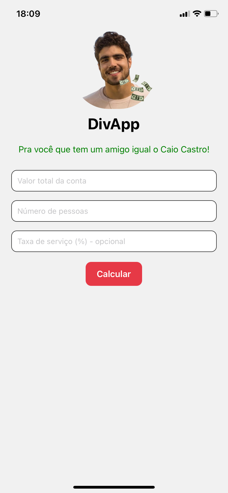

# 💸 DivApp

DivApp é um aplicativo mobile feito em **React Native** com o objetivo de facilitar a divisão de uma conta entre amigos de forma **justa e rápida**. Ele considera o valor total da conta, o número de pessoas e, opcionalmente, uma taxa de serviço (gorjeta).

Além da funcionalidade principal, o app conta com uma **interface estilizada** usando imagens customizadas (`caio.png` e `dinheiro.png`) para deixar o uso mais leve e divertido. 
**Feito pra você, que tem um amigo igual o Caio Castro!** 😂

---

## 🧠 Funcionalidades

- ✅ Inserir valor total da conta
- ✅ Definir número de pessoas
- ✅ Adicionar taxa de serviço (opcional)
- ✅ Calcular automaticamente o valor por pessoa
- ✅ Interface intuitiva e responsiva

---

## 🖼️ Capturas de telas

### Tela de início do APP


### Tela de cálculo do APP


---

## 🛠️ Tecnologias Usadas

* React Native
* JavaScript (ES6+)
* Expo
* Estilização com `StyleSheet` (inline styles)


---

## 🚀 Como Rodar o Projeto

### 1. Clone o repositório

```bash
git clone https://github.com/emillyroar/divapp.git
cd divapp
```

### 2. Instale as dependências

```bash
npm install
```

### 3. Execute com o Expo

```bash
npx expo start
```

Use o aplicativo **Expo Go** no seu celular para escanear o QR Code e testar o app.


---


## 👩‍💻 Desenvolvido por

**Emilly Rodrigues**
🔗 [LinkedIn](https://www.linkedin.com/in/emillyrodrigss)
💻 Desenvolvedora Fullstack | React Native | Node.js | PostgreSQL

---

